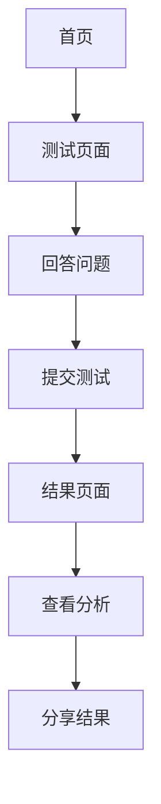

## 1. Product Overview
SBTI 人格测试网站是一个现代化的人格评估工具，旨在提供比传统 MBTI 更具时代性的测试体验。
- 主要目标是帮助用户了解自己的人格类型，通过有趣的问题和视觉化的结果展示。
- 目标用户为年轻人群体，特别是对人格测试感兴趣的互联网用户。

## 2. Core Features

### 2.1 User Roles
| Role | Registration Method | Core Permissions |
|------|---------------------|------------------|
| Normal User | 无需注册 | 参与测试，查看结果 |

### 2.2 Feature Module
1. **首页**：英雄区、测试介绍、开始测试按钮
2. **测试页面**：问题列表、选项选择、进度指示、提交按钮
3. **结果页面**：人格类型结果、详细分析、分享功能

### 2.3 Page Details
| Page Name | Module Name | Feature description |
|-----------|-------------|---------------------|
| 首页 | 英雄区 | 展示测试标题和简短介绍，吸引用户注意力 |
| 首页 | 开始测试按钮 | 点击后跳转到测试页面 |
| 测试页面 | 问题列表 | 显示一系列人格测试问题，每个问题有3个选项 |
| 测试页面 | 选项选择 | 用户可以为每个问题选择一个选项 |
| 测试页面 | 进度指示 | 显示当前测试进度，让用户了解还需回答多少问题 |
| 测试页面 | 提交按钮 | 完成所有问题后点击提交，跳转到结果页面 |
| 结果页面 | 人格类型结果 | 显示用户的 SBTI 人格类型，如 ISTJ、ENFP 等 |
| 结果页面 | 详细分析 | 提供人格类型的详细解释和特点分析 |
| 结果页面 | 分享功能 | 允许用户将测试结果分享到社交媒体 |

## 3. Core Process
用户访问首页，点击"开始测试"按钮进入测试页面，回答一系列问题后提交，系统计算并显示测试结果，用户可以查看详细分析并分享结果。

## 4. User Interface Design
### 4.1 Design Style
- 主色调：紫色系（#6C63FF）和白色（#FFFFFF）
- 辅助色：浅灰色（#F5F5F5）和深灰色（#333333）
- 按钮风格：圆角按钮，有轻微的阴影效果
- 字体：无衬线字体，主标题使用较大字号，正文使用适中字号
- 布局风格：简洁现代，卡片式布局，充分利用空白空间
- 图标风格：简约线条图标，配合文字使用

### 4.2 Page Design Overview
| Page Name | Module Name | UI Elements |
|-----------|-------------|-------------|
| 首页 | 英雄区 | 大号标题，简短介绍文本，居中布局，背景使用渐变色 |
| 首页 | 开始测试按钮 | 突出显示的主按钮，悬停时有轻微动画效果 |
| 测试页面 | 问题列表 | 每个问题单独卡片，清晰的问题文本，选项排列整齐 |
| 测试页面 | 选项选择 | 单选按钮样式，选中状态明显，悬停时有反馈 |
| 测试页面 | 进度指示 | 顶部进度条，显示当前完成百分比 |
| 测试页面 | 提交按钮 | 底部固定位置，完成所有问题后变为可点击状态 |
| 结果页面 | 人格类型结果 | 大号字体显示人格类型，配有相关图标或图形 |
| 结果页面 | 详细分析 | 分点列出人格特点，使用卡片式布局 |
| 结果页面 | 分享功能 | 社交媒体分享按钮，图标清晰可见 |

### 4.3 Responsiveness
- 设计采用桌面优先原则，同时支持移动设备自适应布局
- 在移动设备上，问题和选项会垂直排列，确保良好的触摸体验
- 响应式断点设置：手机（< 768px）、平板（768px - 1024px）、桌面（> 1024px）

### 4.4 3D Scene Guidance
- 无 3D 场景需求