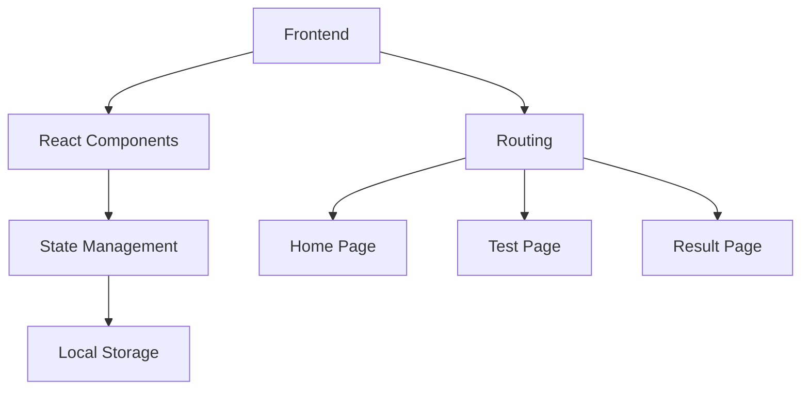
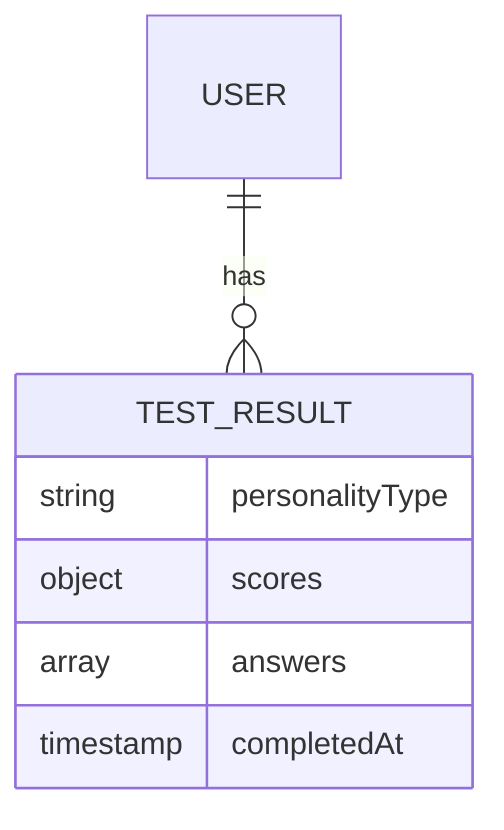

## 1. Architecture Design


## 2. Technology Description
- Frontend: React@18 + tailwindcss@3 + vite
- Initialization Tool: vite-init
- Backend: None (纯前端实现)
- Database: Local Storage (本地存储测试结果)

## 3. Route Definitions
| Route | Purpose |
|-------|---------|
| / | 首页，展示测试介绍和开始按钮 |
| /test | 测试页面，显示问题和选项 |
| /result | 结果页面，显示测试结果和分析 |

## 4. API Definitions
- 无后端 API 需求，所有功能在前端实现

## 5. Server Architecture Diagram
- 无后端服务器架构

## 6. Data Model
### 6.1 Data Model Definition


### 6.2 Data Definition Language
- 无数据库表结构，使用本地存储存储测试结果
- 本地存储结构：
  ```javascript
  {
    "personalityType": "ISTJ",
    "scores": {
      "E": 2,
      "I": 8,
      "S": 7,
      "N": 3,
      "T": 6,
      "F": 4,
      "J": 9,
      "P": 1
    },
    "answers": [1, 2, 3, ...], // 每个问题的选项索引
    "completedAt": "2023-10-01T12:00:00Z"
  }
  ```